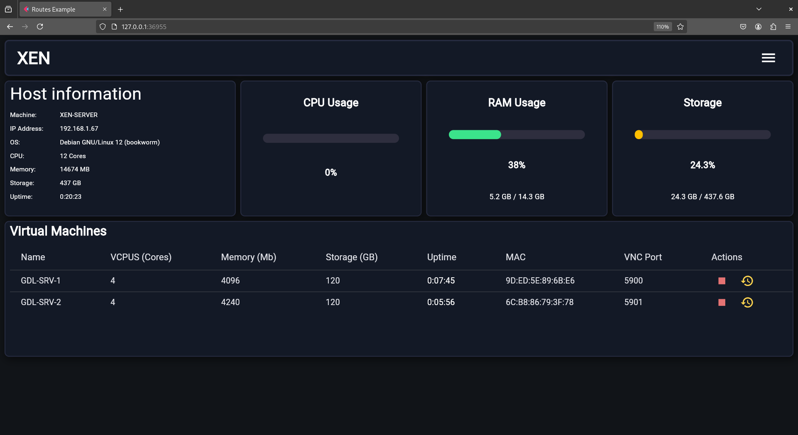
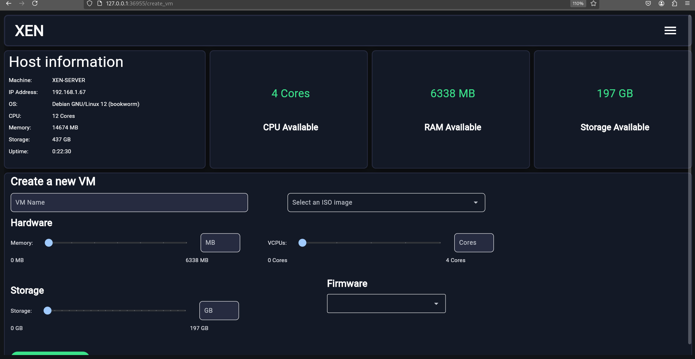
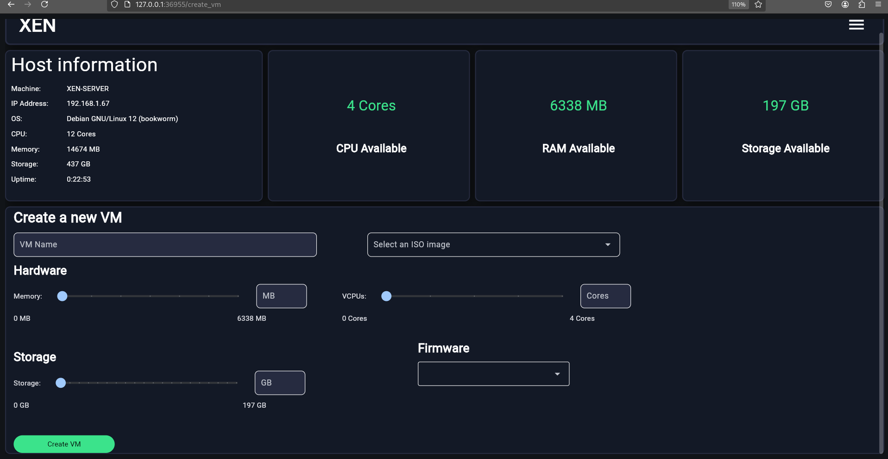
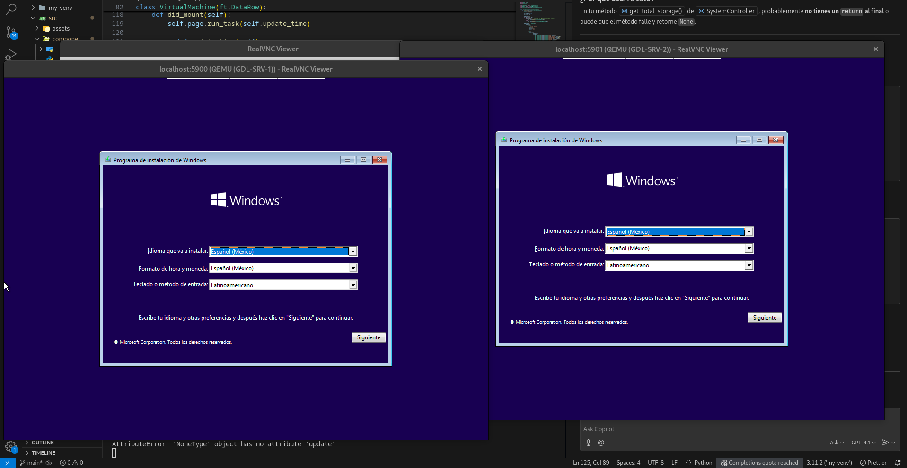

# Xen Resource Dashboard

A modern dashboard built with [Flet](https://flet.dev/) for monitoring and managing Xen virtual machines.  
It displays host information, CPU, RAM, and storage usage, as well as available resources and VM management features.

## Features

- **Host Information:** Machine name, IP, OS, CPU, RAM, storage, and uptime.
- **Resource Charts:** Real-time CPU, RAM, and storage usage with dynamic color bars.
- **Available Resources:** Quick view of available CPU cores, RAM, and storage.
- **VM Management:** Create and manage virtual machines with a user-friendly form.
- **Responsive UI:** Clean, dark-themed interface with clear alignment and spacing.

## Screenshots

